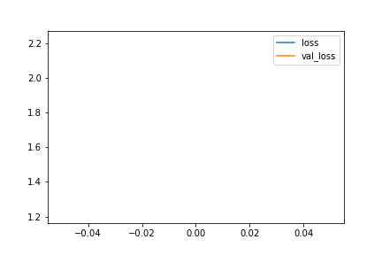
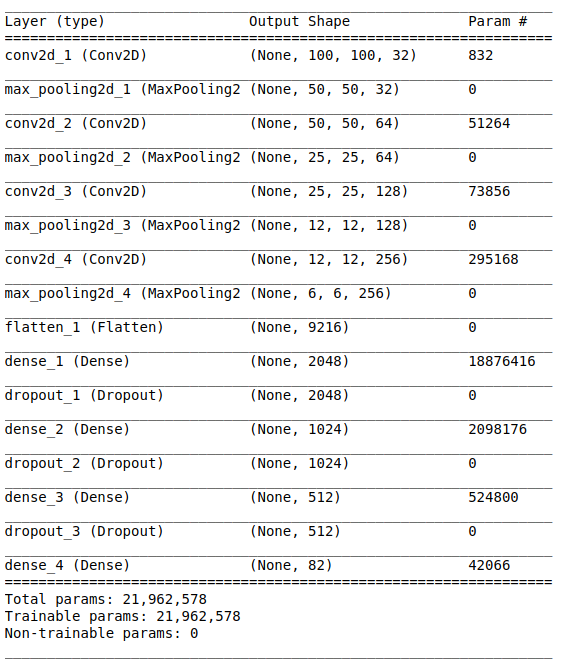
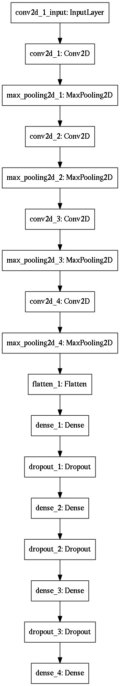

# Temperature-Prediction

Relative Temperature Prediction from thermometer images using CNN

# Requirements
1. keras
2. opencv
3. tensorflow
4. pydot
5. graphviz
6. matplotlib
7. sklearn

# Run
1. Install the requirements for the projects by running, `pip install -r requirements.txt`
2. `jupyter notebook Thermometer-Level-Prediction.ipynb` to open the Jupyter notebook [Recommended]
3. Alternatively, the code can be run from `python runModel.py ` through terminal. Please note, the real time loss, and analysis is disabled for this script[Not Recommended]

# Model
A CNN is trained on the task for predicting "relative reading" from a thermometer image using "Categorical Cross-entropy loss". The training and validation loss over time(of epochs) can be found in `figs/` directory. The model is evaluated using "Accuracy" metric. However, the overall performance of the model is also evaluated by a secondary metric(+1/-1 metric), where the prediction is assumed correct if the prediction is within the range of [-1, +1] around the ground truth, i.e a prediction of (46, 47, 48) is acceptable in case where ground truth is 47

|                 | Train Accuracy | Test Accuracy |
|-----------------|----------------|---------------|
| Accuracy Metric | 87.94          | 82.30         |
| +1/-1 Metric    | 94.54          | 90.9          |

Cases with exact match, correct prediction based on +1/-1 metric, and failure cases are discussed in the jupyter notebook  `Thermometer-Level-Prediction.ipynb`

## Loss

## Discussions
1. The input to the CNN is a transformed image such that only the level of the thermometer is fed to the network. This is implemented in 'img_transform' in `getData.py` utility file.
2. Transformation: The image is thresholded in the HSV domain, and contours are obtained on the resulting image in the "Saturation" channel. In case where there are more than two contours, the biggest contour is selected (Assumption: Thermometer level is the largest continuous object in the image)
3. Imbalance across train and test set is cleaned using 'imbalance' in `getData.py` utility file. Only the classes occurring in both train and test sets are kept, rest discarded.
4. A label encoder is used to encode the classes in range[0, 82), as keras takes in continuous class numbers, which the data strictly doesn't follow
5. Model Parameters:
    1. With lower number of conv layers, the model saturates at ~75% accuracy, hence more conv layers with more filters are used, so that the model is complex enough to learn
    2. Similar reasoning is used for using multiple fully connected layers
    3. A trend is maintained where as we go deeper in the network, the input sizes decrease(due to max pool), and filter depth increases
    4. Model overfits badly unless dropout layer is used, hence a 50% dropout is used with all three FC layers
    5. A higher dropout of 80%, 70% and 60% were tried, which made the network less prone to overfitting for longer duration, but the network settled with similar metrics as with 50% dropout. As training with 50% dropout was faster, we stick with it.
    6. L-1 regularization was also tried, which performed very badly
    7. The input shape to the CNN is (100,100) with square filters of (5,5) and (3,3). As originally the image was skinny and tall, an alternate setup with input size = (225, 45) with tall, skinny convolutions of (11, 3) and (7, 3) were also tried. The performance of the model was similar to the present model, as it provides no useful advantage, we stick with the more traditional setup of square images.
    8. Adam optimizer is used
    9. Image Augmentation to produce artificial data is also tried to combat the overfitting problem, but with a greater overhead on running time, and almost similar results to the final model, the augmentation was left out. You can still use data augmentation by editting `datagen = True` while training
6. The trained model is stored in `model/` directory

 ## Model Parameters
 

## Model Architechture

# TODO
- [ ] Better Pre-processing to reduce prediction errors (see analysis section in jupyter notebook)
